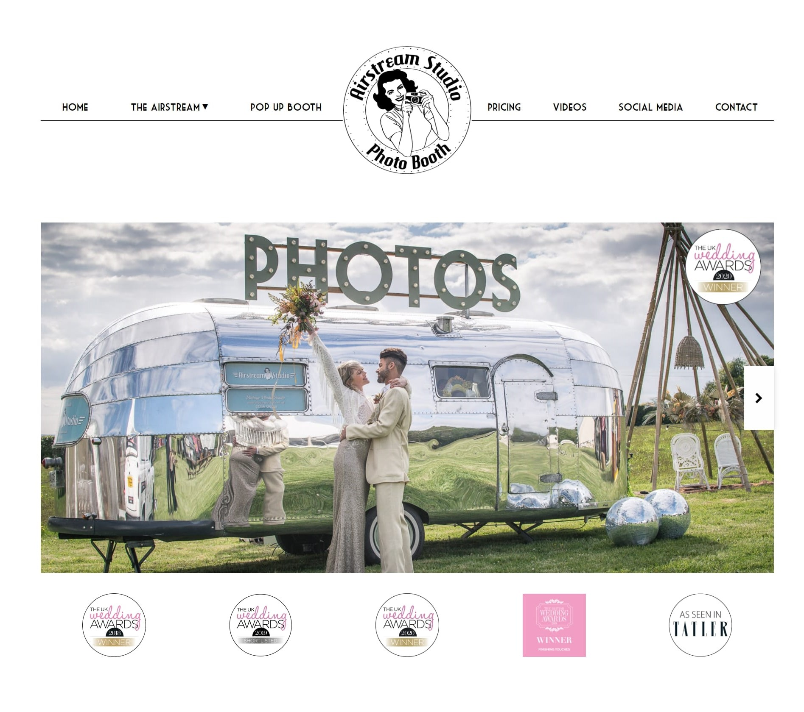

# airstream-studio

[https://www.airstreamstudio.uk/](https://www.airstreamstudio.uk/)

Airstream studio's jekyll static site

## Todo
- [x] Plan content and design, with client
- [x] Send over sketch designs
- [x] Build site

## Technical decisions
I went with a simple jekyll static site hosted on github pages. For content editing I used a CMS called [siteleaf](https://www.siteleaf.com/) which integrates well with jekyll and github. It means when updates are made in the nice interface provided by siteleaf, it commits and pushes an update to the YAML files that the jekyll site builds from, hence updating its content.
